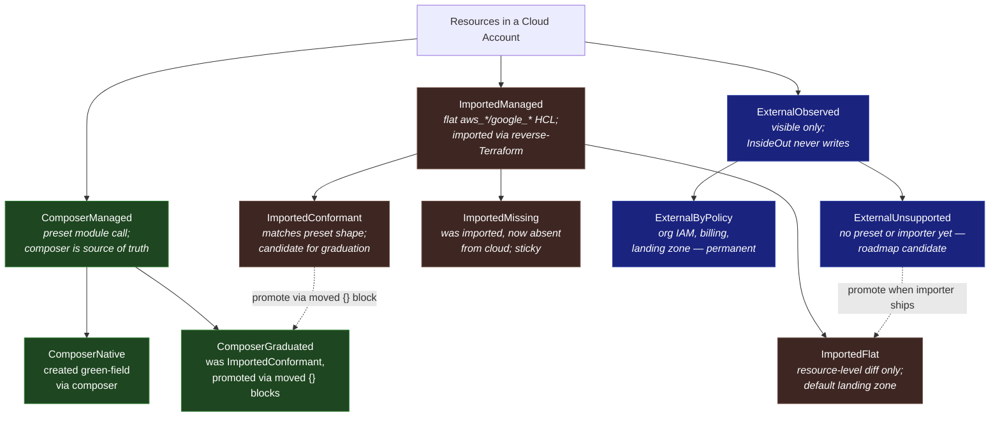
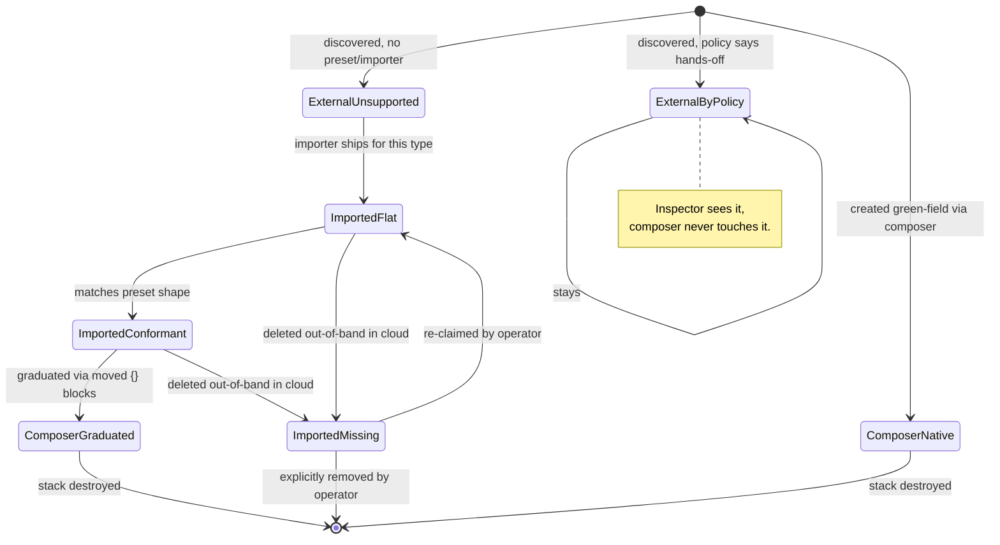

# Managed Resource Tiers

Working model for how InsideOut classifies cloud resources across the
composer-managed, imported, and externally-observed spectrum — and what the
IR / diff machinery in `pkg/composer` needs to grow to support it.

Related: #56 (umbrella reverse-Terraform design), #57 (Phase 1 AWS import), PR #58.

## A note on naming

Tiers are referred to by **stable names**, not numbers. Numbers shift when
categories are added or removed; names describe what the tier *is* and stay
stable across roadmap changes. The Go code, salience maps, and on-the-wire
JSON all use the stable names below.

## The tier tree



## What each tier means

### ComposerManaged
Resources created and owned through an InsideOut preset module call
(`module "vpc" { source = "./aws/vpc" ... }`). The composer wires variables,
the `luthername` invariant holds, defaults are opinionated, drift is fully
manageable through the preset's surface.

- **`ComposerNative`** — composer-generated from session config.
- **`ComposerGraduated`** — was `ImportedConformant`, promoted via
  `moved {}` blocks once the resource graph proved compatible with a
  preset's shape.

### ImportedManaged
Resources that exist in the account before InsideOut sees them. The reverse-
Terraform tool (`insideout-import`) discovers them and emits flat HCL so
Riley/Reliable can diff and change them. **No attempt** to fit them inside
preset module calls by default.

- **`ImportedFlat`** — `aws_sqs_queue.dlq { ... }`, with all attributes
  preserved verbatim. Diff and change happen at the resource level.
- **`ImportedConformant`** — the imported graph happens to match what a
  preset would produce. Marked as a graduation candidate; promotion to
  `ComposerGraduated` is a deliberate, reviewable step (not automatic).
- **`ImportedMissing`** — was previously imported, now absent from cloud.
  Sticky in the model; the importer does not auto-prune. Surfaces as an
  alert until the operator explicitly removes or re-claims it.

### ExternalObserved
Resources visible to InsideOut's inspector but never written to or planned
against.

- **`ExternalByPolicy`** — hands-off by policy. Org IAM, payer billing,
  landing-zone scaffolding, anything owned by another team. Permanent.
- **`ExternalUnsupported`** — by tooling gap. No preset, no importer, or
  both. Roadmap-driven; shrinks each release.

## Lifecycle — how a resource moves between tiers



## The typed model — two-layer code generation

The IR for imported resources is split into two layers that change at different rates.

### Layer 1 — generated, full-fidelity (churns with the provider)

One Go struct per supported resource type, code-generated from
`terraform providers schema -json`. **Every** provider field is present, with
`*T` for nullability so "absent in HCL" is distinguishable from zero values.
Provider upgrades trigger regen; removed fields surface as Go compile errors
in any consumer code that referenced them — a feature, not a bug.

```go
// generated/aws_sqs_queue.gen.go  (do not edit)
type AWSSQSQueue struct {
    Name                       *string  `tf:"name"`
    FifoQueue                  *bool    `tf:"fifo_queue"`
    VisibilityTimeoutSeconds   *int     `tf:"visibility_timeout_seconds"`
    KMSMasterKeyID             *string  `tf:"kms_master_key_id"`
    RedrivePolicy              *string  `tf:"redrive_policy"`
    // ... every SQS field, regenerated on provider bumps
}
```

Code-gen is its own workstream (~1–2k LOC of generator → ~10–15k LOC
generated). PR #58 / Phase 1 ships with a hand-written carrier holding an
opaque attribute bag; codegen lands in Phase 2 and back-fills the typed
surface.

### Layer 2 — hand-curated salience map (rarely churns)

#### Purpose

The salience layer has **two jobs**:

1. **Metadata** — annotate each field with its `Role` (Identity / Wiring /
   Tuning) and optionally a `Pillar` (Security / Performance / Reliability).
   Drives diff grouping, badging, and Riley's prompt context.
2. **Write-permission boundary** — only fields present in the salience map
   are editable by Riley via the chat-authoring path. Fields outside Layer 2
   still round-trip through the model (Layer 1 preserves them) but are
   write-protected against the chat flow.

This separates **"every field on a resource"** (Layer 1, complete and
generated) from **"what each field *means*, and who can write it"** (Layer 2,
curated).

#### Editor authority

| Population | Riley (chat) | Importer | Direct HCL edit |
|------------|:---:|:---:|:---:|
| In Layer 1, NOT in Layer 2 | Read only | Read + write | Read + write |
| In Layer 1 AND in Layer 2  | Read + write | Read + write | Read + write |

The importer is the only path that can author *new* `ImportedManaged`
resources. Riley can modify existing ones but only within the salience-tagged
subset of fields. To change an unexposed field, a user must re-run the
importer, graduate to `ComposerManaged`, or escalate to direct HCL.

Reliable's UI today is **chat-driven**, not form-driven: users edit via
conversation with Riley, who emits a full `[Core.*]` state block; the server
re-extracts `(Components, Config)` from the stream, writes a `draft` row in
`stack_versions`, and renders the snapshot-vs-snapshot diff
(`composer.DiffComponents` / `DiffConfigs`) as highlights. There is no
field-level pending-change object, no client-side form state, no
confirmation-modal flow.

Given that architecture, the salience layer's **actual** consumers are:

| Consumer | What salience drives |
|----------|----------------------|
| **Riley** (system prompt + correction loop) | Defines the editable surface. Riley sees the salience-tagged subset (~5–15 fields per type) in his prompt; an `INTERNAL CORRECTION:` turn fires if he emits a write to a field outside Layer 2. Pillar tags drive in-chat confirmation prompts for security-relevant edits. |
| **Diff renderer** (`lib/stack/types.ts::ResourceDiff`) | Groups, summarizes, and badges field-level diffs by Pillar (e.g. "3 security changes, 1 reliability change"). Replaces today's per-component `category` string with per-field richness. |
| **Composer's cross-ref resolver** | `Role=Wiring` is the marker the resolver uses to rewrite hardcoded ARNs/IDs into `aws_*.x.attr` references during stack emission. This is the only consumer of `Role`. |
| **Pre-deploy validators** | `Role=Identity` and certain `Pillar=Security` fields flagged as immutable post-apply (changing them = destroy/recreate) feed into `composer.ValidateDeployConstraints`. |
| **Server-side write authorization** | A new `validateImportedResources` (sibling to `validateConfigValues`) rejects any Riley-emitted change to a field not in the salience map. |

It is **not**:
- A schema (Layer 1 is the schema)
- A validation system (validators live in `pkg/composer/validate.go`)
- A drift detector (Reliable does that on tfstate, post-apply)
- A cost/pricing calculator (separate concern in `pricing_deps.go`)
- A driver of form widgets or confirmation modals — there are none today

#### Shape

```go
type FieldSalience struct {
    Role   FieldRole    // Identity | Wiring | Tuning  (required)
    Pillar FieldPillar  // Security | Performance | Reliability | None
}

// curated/aws_sqs_queue.salience.go
var awsSQSQueueSalience = map[string]FieldSalience{
    "name":                     {Role: Identity},
    "kms_master_key_id":        {Role: Wiring,  Pillar: Security},
    "redrive_policy":           {Role: Wiring,  Pillar: Reliability},
    "sqs_managed_sse_enabled":  {Role: Tuning,  Pillar: Security},
    "visibility_timeout_seconds": {Role: Tuning, Pillar: Reliability},
    // unspecified fields → {Role: Tuning, Pillar: None}
}
```

#### The two axes

**Axis 1 — Role (structural, every field has one):**

| Role | Meaning | Examples |
|------|---------|----------|
| `Identity` | What makes this resource itself | `name`, `arn`, `region` |
| `Wiring` | Cross-reference to another resource | `kms_key_id`, `subnet_ids`, `role_arn`, `redrive_policy` |
| `Tuning` | Everything else | `visibility_timeout_seconds`, `delay_seconds`, `tags` |

`Wiring` is what makes cross-tier dependency reconstruction possible — it
identifies the fields the importer's cross-ref resolver should rewrite as
Terraform references.

**Axis 2 — Pillar (operational, optional):**

| Pillar | Meaning | Examples |
|--------|---------|----------|
| `Security` | Encryption, IAM, public access, network exposure | `kms_master_key_id`, `policy`, `publicly_accessible` |
| `Performance` | Capacity, throughput, caching, indexes | `instance_class`, `provisioned_throughput`, `cache_size` |
| `Reliability` | Backups, replication, multi-AZ, retry/DLQ | `backup_retention_period`, `multi_az`, `redrive_policy` |
| `None` | No operational pillar applies | — |

This vocabulary aligns with reliable's existing `eval_scoring.go` categories
(`Security`, `Performance`, `Ops Excellence`) modulo the rename of
`Ops Excellence` → `Reliability` to match AWS Well-Architected vocabulary
and provide field-level semantics actionable enough to drive UX decisions.
Reliable's check-level `Severity` (`critical | high | medium`) is
perpendicular and unaffected.

A field can have both a `Role` and a `Pillar`: `kms_master_key_id` is
`Role=Wiring, Pillar=Security` — accurate on both dimensions, and Reliable
can use either when scoping a query.

### Why two layers, not one

| Concern | How layering addresses it |
|---------|---------------------------|
| Users want to alter any field | Layer 1 has every field, fully typed |
| Provider schema rot | Regen Layer 1; downstream only breaks when it referenced a removed field |
| Some fields matter more than others | Layer 2 expresses that without affecting Layer 1's completeness |
| "Don't replicate the AWS provider model" | We do — but generated, not hand-maintained. Same cost Pulumi/CDK pay. |
| Code-gen is heavy upfront | Phase 1 ships with opaque bag; Phase 2 swaps in generated structs |

## How this maps to the current `pkg/composer` IR

The composer's IR today is **`ComposerManaged`-only**. Concretely:

- `Components` (`pkg/composer/types.go`) is a flat struct of ~88 toggles —
  one cell per cloud-service-type (`AWSVPC string`, `AWSRDS *bool`, etc.).
  Each cell answers "do we want this preset on?" with at most a small enum
  payload (`"Private" | "Public"`, `"Intel" | "ARM"`).
- `ComponentKey` (`pkg/composer/contracts.go`) is the canonical identifier —
  `aws_vpc`, `gcp_gke`. There is no notion of multiple instances of the same
  type, no resource address, no source-of-truth provenance.
- `DiffConfigs(old, new Config)` (`pkg/composer/diff.go`) is **desired vs
  desired**. It compares two IR snapshots. It never reads `.tfstate`, never
  calls a cloud API, never sees `terraform plan` output.
- `ComponentDiff.Action` is `"added" | "removed" | "modified"` against the
  toggle space — there is no representation for "exists in cloud, not in IR"
  or "managed externally, ignore".

### Gaps the model has to grow to fit `ImportedManaged` and `ExternalObserved`

| Need | Why current IR can't carry it | Sketch of extension |
|------|------------------------------|---------------------|
| Multiple instances per type | `Components.AWSVPC` is a single toggle | New `ImportedResources []ImportedResource` collection keyed by Terraform address |
| Resource-level identity | No address concept (`aws_vpc.prod_vpc_1`) | `ImportedResource.Address` (`aws_vpc.prod_vpc_1`), `.ImportID`, `.Provider` |
| Provenance / tier classification | All cells are implicitly `ComposerManaged` | `ImportedResource.Tier` enum + `Source` (composer / importer / inspector) |
| Opaque attribute bag | Components hold a small fixed surface | `ImportedResource.Attributes map[string]any` (or raw HCL body) so flat imports survive round-trip |
| Cloud-vs-desired diff | Diff is desired-vs-desired only | New `DriftDiff` shape that joins discovered cloud state ↔ IR by address |
| Graduation marker | No way to mark "candidate for promotion" | `ImportedResource.GraduationCandidate *PresetMatch` populated by a shape-matcher |
| External / hands-off marker | Toggles can only be on/off | `ImportedResource.Tier == ExternalByPolicy` short-circuits the planner |

A first cut at the carrier type:

```go
// Tier names are stable identifiers. Order is not significant; categories
// can be added or removed without renumbering anything.
type Tier string

const (
    TierComposerNative      Tier = "ComposerNative"
    TierComposerGraduated   Tier = "ComposerGraduated"
    TierImportedFlat        Tier = "ImportedFlat"
    TierImportedConformant  Tier = "ImportedConformant"
    TierImportedMissing     Tier = "ImportedMissing"
    TierExternalByPolicy    Tier = "ExternalByPolicy"
    TierExternalUnsupported Tier = "ExternalUnsupported"
)

// Composite identity: (Provider, Type, Address) is unique within a stack;
// ImportID provides the cloud-side cross-index for correlation.
type ImportedResource struct {
    Provider   string         // aws | google
    Type       string         // aws_sqs_queue
    Address    string         // aws_sqs_queue.dlq
    ImportID   string         // arn:aws:sqs:... or queue URL

    Tier       Tier           // see constants above
    Source     Source         // composer | importer | inspector

    // Phase 1: opaque attribute bag, preserved verbatim for round-trip.
    // Phase 2: replaced by a typed Attrs field of an interface backed by
    //          per-type generated structs (see "Two-layer typed model" above).
    Attributes map[string]any

    // FieldEdits tracks which fields have been edited via the chat / API
    // path since the last successful `terraform apply`. Used by re-import
    // (decision #19) to detect conflicts between Riley's pending edits and
    // independent cloud changes. Cleared when an apply succeeds.
    FieldEdits map[string]FieldEdit

    // Graduation hint: populated by a shape-matcher when the imported graph
    // looks like it could be wrapped in a preset module call.
    // (Phase 3+ — see decision #16.)
    GraduationCandidate *PresetMatch
}

type FieldEdit struct {
    Source    Source    // riley | api | mcp
    EditedAt  time.Time
    OldValue  any       // pre-edit value, retained for the conflict UI
    NewValue  any       // post-edit value (current value in the model)
}

type PresetMatch struct {
    PresetKey      ComponentKey // aws_vpc, aws_rds, ...
    Confidence     float64
    MovedBlocks    []MovedBlock // proposed `moved {}` blocks for promotion
    BlockingDeltas []FieldDiff  // attrs that would have to change to fit
}
```

Diff then becomes a union over `(Components, ImportedResources)` — the
existing `ComponentDiff` engine still handles the toggle space; a new
`ResourceDiff` covers `ImportedManaged`; `ExternalObserved` resources stay
in the model but are excluded from the planner (visible to the inspector /
alert pipeline only).

### Composer responsibilities for imported resources

The composer (`pkg/composer/compose.go`) is the only code path that emits the
final terraform stack. The typed model is inert without composer changes —
it would let the UI describe edits but never apply them. Specifically the
composer must:

1. **Accept `ImportedResources` as input.** `ComposeStackWithIssues` grows
   a third argument (or its `Snapshot` shape grows the field) so it has the
   imported set in addition to `Components` / `Config`.
2. **Emit flat HCL blocks** for each `ImportedFlat` / `ImportedConformant`
   resource alongside the `module "..."` blocks in the composed `main.tf`.
3. **Apply `FieldEdits` overlays before emission.** This is the mechanism
   by which Riley's chat edits become terraform changes: for each pending
   edit on an imported resource, the composer overlays the `NewValue` onto
   the Layer-1 attribute set before serializing to HCL.
4. **Wire cross-tier references.** When a composer-managed module call
   needs to reference an imported resource (e.g.
   `module "lambda" { dlq_arn = aws_sqs_queue.dlq.arn }`), or vice versa,
   the composer emits the correct Terraform reference. `Role=Wiring` from
   the salience map identifies the fields that participate in this graph.
5. **Inject provenance tags on every emission.** The `InsideOutImport*`
   tags are emitted via `merge()` on every `terraform apply` — not just at
   first import — so a resource that loses its tags out-of-band gets them
   back on the next apply.
6. **Skip emission for non-managed tiers.** `ImportedMissing`,
   `ExternalByPolicy`, and `ExternalUnsupported` are not written to the
   composed root (the planner ignores them). They remain in the snapshot
   for the inspector / alert pipeline.
7. **Validate the union graph.** Existing validators
   (`validate_module_graph.go`, `validate_providers.go`,
   `validate_composed_root.go`) need to recognize flat imported resources
   as graph nodes alongside `module.<name>`. Cycle detection, provider
   version conflicts, HCL parseability, and required-variable aggregation
   all operate on the union.

In other words: the typed model + salience layer + diff machinery are *for
authoring*. The composer is *for execution*. Both halves are required for
imports to be a first-class managed tier rather than a one-shot import-and-
forget transcript.

### Two different things called "drift"

Worth being explicit about responsibility because the word "drift" gets used
for two unrelated things:

| | Pre-apply (UI staging) | Post-apply (operational drift) |
|---|---|---|
| What it compares | Last applied snapshot vs new draft snapshot | tfstate vs cloud reality |
| Purpose | Stage user changes for review | Alert on operational divergence |
| Trigger | Riley emits a `[Core.*]` state block in chat | Periodic Oracle pull |
| Output | `composer.VersionDiff` rendered as highlights | Drift banner + alert |
| How it's stored | Immutable `stack_versions` rows (`draft → confirmed → applied`) | `StackMeta.driftReason`, `driftByComponent` |
| Consumes this model | **Yes — directly** | No (works on tfstate / cloud APIs) |
| Lives in | reliable's chat handler + composer diff functions | reliable + Oracle |

The two channels are **not joined**. Drift surfaces as a banner; editing is
never blocked by drift. So the typed model's primary job is:

- **Authoring fidelity** — round-trip HCL ↔ struct ↔ HCL with zero loss
- **Snapshot-friendly** — JSON-serializable into `stack_versions.components`
  / `.config` columns alongside today's `Components` and `Config`
- **Diffable** — `composer.DiffConfigs` (or a new sibling) can produce a
  field-level `VersionDiff` between two snapshots

It does **not** need to support: in-memory mutation, partial commits, draft
objects, three-way merges, or form-level validation. Those concerns simply
don't exist in this architecture.

## What this means for PR #58 / issue #56

- PR #58 lands `ImportedFlat` mechanics (flat import, zero-drift output) —
  the right shape for the default landing zone.
- The composer IR doesn't yet model anything beyond `ComposerManaged`, so
  Riley/Reliable can't currently diff against imported HCL through the same
  code path it uses for composer-generated stacks. That's the next bit of
  work.
- `ImportedConformant` (shape-matching → graduation) and the
  `ImportedResource` carrier are good candidates for a follow-up issue under
  the #56 umbrella, separate from "expand resource coverage" and "module
  mapping".

## Decisions captured (April 2026)

| # | Decision | Choice |
|---|----------|--------|
| 1 | Cross-tier wiring | **Single IR**, `Components` and `ImportedResources` as peer collections, composer can reference both |
| 2 | Typing strategy | **Two-layer**: code-gen full-fidelity Layer 1, hand-curated salience Layer 2 |
| 3 | Code-gen scope | **All fields** of every supported resource type, regenerated on provider bumps |
| 4 | UI staging architecture | **Chat-driven** via Riley + snapshot-vs-snapshot diff (matches existing `stack_versions` flow); no client-side draft, no field-level pending changes, no form |
| 5 | Resource identity | **Composite** `(Provider, Type, Address)`, with `ImportID` (ARN or URL) as cross-index |
| 6 | `ExternalObserved` handling | **In the model** with `ExternalByPolicy` / `ExternalUnsupported` flags; planner skips them, inspector / alert pipeline observes them |
| 7 | Salience taxonomy | **Two perpendicular axes**: `Role` (Identity \| Wiring \| Tuning) and `Pillar` (Security \| Performance \| Reliability \| None) |
| 8 | Salience as write boundary | **Yes** — Riley can only edit fields present in Layer 2; importer can write any Layer 1 field |
| 9 | Authorship model | **Hybrid** — importer is the only creator of new imported resources; Riley can modify existing ones within the salience-tagged surface |
| 10 | Snapshot persistence | **New top-level field** `Imported` on `StackVersion` (sibling to `Components` / `Config` / `Pricing`); separate JSON column |
| 11 | Diff representation | **`ResourceDiff` sibling** to `ComponentDiff`, keyed by `(Type, Address)` with field-level `Changes []FieldDiff`; `VersionDiff` grows a `Resources []ResourceDiff` field |
| 12 | Riley's prompt surface | **Salience-tagged subset only** (~5–15 fields per type); fields outside Layer 2 are invisible to chat |
| 13 | Importer UX | **Separate UI**, outside Riley chat. Importer results are injected into Riley's session as context so he can reason about them, but Riley does not orchestrate the import. |
| 14 | Salience as authorization | **Universal** — every write path (chat, API, MCP) is bounded by Layer 2. Only the importer can write Layer 1 fields outside the salience map. |
| 15 | Salience extensibility | **Code only** in v1 — salience map ships as Go source; expanding it requires a release. No customer overlay. |
| 16 | `ImportedConformant` graduation | **Deferred to Phase 3+** — Phase 2 ships `ImportedFlat` only. |
| 17 | Provenance tags | **Distinct `InsideOutImport*` namespace** (AWS) / `insideout-import-*` (GCP) — `ImportedManaged` resources do *not* share `ComposerManaged`'s generic `Project` tag. Importer adds tags if missing, never overwrites. Tags double as a soft lock for cross-session mutual exclusion. See "Provenance tagging policy" below. |
| 18 | Phase 1 scope | Hand-written carrier with opaque attribute bag; codegen + salience map land in Phase 2 |
| 19 | Re-import conflict resolution | **Surface to operator** — importer refuses to clobber a field that Riley has edited since the last apply. Conflict emitted as a `ValidationIssue`; operator resolves (accept cloud / keep edit / abort). Requires per-field edit tracking on `ImportedResource`. |
| 20 | Out-of-band deletion | **Sticky `ImportedMissing` flag + user surfacing** — when the importer discovers a previously-imported resource is gone from cloud, it does *not* auto-prune. The resource remains in the model with `Tier = ImportedMissing`, and the existing drift alert channel surfaces it to the user. Removal requires explicit operator action. |
| 21 | Phase 2 scope | **Codegen the original 10** (5 AWS + 5 GCP from PR #58) plus the codegen pipeline itself. Each subsequent resource-type expansion ships its own codegen + salience entries as a separate increment. Avoids a single giant Phase 2 PR. |
| 22 | Tier naming | **Stable string identifiers**, not numbered — adding/removing categories does not require renumbering. Constants live in `pkg/composer/imported.go` (or sibling). |
| 23 | Composer execution path | **`ComposeStackWithIssues` extended** to accept `ImportedResources`, emit flat HCL alongside module calls, apply `FieldEdits` overlays before emission, wire cross-tier references, and validate the union graph. Without this, the typed model has no execution path. |

## Provenance tagging policy

Provenance tags serve two purposes:

1. **Inspector filtering.** The reliable3 inspector filters resources by tag
   match. Imported resources without the right tag are invisible to drift
   detection and CloudWatch metrics (see CLAUDE.md and reliable PR #1027).
2. **Mutual exclusion across sessions.** The tags act as a soft lock so two
   InsideOut sessions can't independently claim the same cloud resource.

### Why a distinct namespace from `ComposerManaged`'s `Project` tag

`ComposerManaged` resources use the generic `Project = <session>` tag. If
`ImportedManaged` resources also used `Project`, two issues compound:

- A second session importing the same resource would silently overwrite
  `Project`, "stealing" it from the first session
- The inspector couldn't distinguish "we created this" from "we imported this"

So `ImportedManaged` resources get a **distinct `InsideOutImport*`
namespace**.

### Required tags / labels

**AWS** (tag keys; allowed chars `[A-Za-z0-9 +-=._:/@]`, max 128):

| Tag key | Value | Purpose |
|---------|-------|---------|
| `InsideOutImportProject` | `<import-project-id>` | Claim / ownership. Inspector filters on this for `ImportedManaged`. |
| `InsideOutImportSession` | `<session-id>` | Finer grain when a project has multiple concurrent sessions. |
| `InsideOutImported` | `"true"` | Cheap provenance marker for ad-hoc filtering / audit. |
| `InsideOutImportedAt` | ISO-8601 UTC timestamp at first import | Audit / age tracking. |

**GCP** (label keys; lowercase letters / digits / `-` / `_`; must start with
a lowercase letter; max 63 chars):

| Label key | Value | Purpose |
|-----------|-------|---------|
| `insideout-import-project` | `<import-project-id>` | Mirror of `InsideOutImportProject`. |
| `insideout-import-session` | `<session-id>` | Mirror of `InsideOutImportSession`. |
| `insideout-imported` | `"true"` | Provenance marker. |
| `insideout-imported-at` | ISO-8601 timestamp (no `:` or `+` — GCP labels disallow them; encode as `2026-04-27t14-30-00z`) | Audit / age. |

### Mutual exclusion semantics

Before claiming a resource, the importer reads
`InsideOutImportProject` (AWS) / `insideout-import-project` (GCP):

| Existing value | Action |
|----------------|--------|
| Absent | Safe to claim. Importer writes the full tag set. |
| Equals current import-project-id | Already mine; idempotent re-import; refresh `InsideOutImportedAt` only if needed. |
| Differs from current import-project-id | Another session owns this. Importer refuses + emits a `ValidationIssue`. Operator must explicitly force-takeover or skip. |

### Apply rules

- **Distinct namespace; never write generic `Project`.** `ImportedManaged`
  resources do not get a `Project` tag — that's reserved for
  `ComposerManaged`. This avoids silent ownership conflicts.
- **Add only if missing.** The importer never overwrites an existing
  `InsideOutImport*` tag without explicit operator action.
- **Preserve existing tags.** All tags present on the cloud resource at
  import time round-trip through Layer 1 verbatim, including any pre-existing
  `Project` tag (which is left alone but warned about — see below).
- **Warn on pre-existing `Project` tag.** If a resource already carries a
  `Project` tag (because someone manually labeled it before InsideOut
  arrived), the importer logs a warning + emits a `ValidationIssue`. The
  value is preserved verbatim; the operator decides whether to clean it up.
- **Apply via terraform, not the cloud API.** Tag injection happens in the
  generated HCL (`tags = merge({ InsideOutImportProject = "..." }, ...)`),
  so the next `terraform apply` writes them to the cloud. The importer does
  not call cloud APIs directly to mutate tags.
- **Skip unsupported resources.** Some AWS/GCP resource types do not accept
  tags or labels at all; the importer enumerates these via Layer 1 schema
  introspection and skips tag injection for them, logging a notice and
  flagging them in the inspector view as "unmanageable lock — operate with
  care."

### Downstream dependency on reliable

Reliable's inspector currently filters on `Project = <project>` only. To
see `ImportedManaged` resources it must learn the new namespace — its
effective filter becomes:

```
Project = <project> OR InsideOutImportProject = <project>
```

This is a reliable-repo change (not insideout-terraform-presets); the import
PR should be paired with a reliable PR that extends the inspector filter and
the corresponding GCP label query.

## Open questions

1. Is graduation (`ImportedConformant` → `ComposerGraduated`) ever fully
   automatic, or always human-gated? *(Deferred to Phase 3+ per decision
   #16, but the question still stands when we get there.)*
2. When the AWS/GCP provider adds a field that's clearly security-relevant,
   what's the process for adding it to Layer 2's salience map? (Layer 1
   regen is mechanical; Layer 2 needs a human in the loop.)
3. Does Reliable's check vocabulary in `eval_scoring.go` rename
   `Ops Excellence` → `Reliability` to match this taxonomy, or do we accept
   the per-tool difference?
4. **Riley's awareness of importer results** — decision #13 says results
   are injected into Riley's session as context. What's the shape — a
   summary message, a tool-result block, an updated `[Imported.*]` snippet
   in the system prompt? Reliable-side decision but worth noting since it
   affects how Riley narrates imports to the user.
5. **Force-takeover UX for cross-session conflicts** — when the importer
   refuses a claim because `InsideOutImportProject` points elsewhere
   (mutual-exclusion check), what's the operator's path to override? CLI
   flag (`--force-takeover`)? Reliable UI button? Manual tag deletion?
   The mechanism needs to be explicit and audited.
6. **Cross-cloud session ID conventions** — does the same `<import-project-id>`
   value get used for both AWS `InsideOutImportProject` and GCP
   `insideout-import-project` when a session spans both clouds, or do we
   namespace per-cloud?
