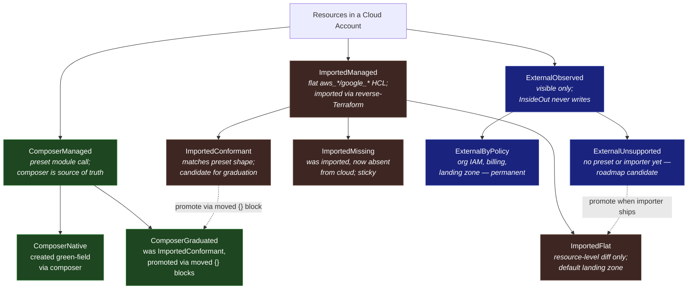
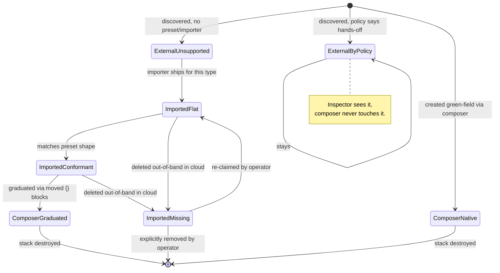

# Managed Resource Tiers

Working model for how InsideOut classifies cloud resources across the
composer-managed, imported, and externally-observed spectrum — and what the
IR / diff machinery in `pkg/composer` needs to grow to support it.

Related: #56 (umbrella reverse-Terraform design), #57 (Phase 1 AWS import), PR #58.

## A note on naming

Tiers are referred to by **stable names**, not numbers. Numbers shift when
categories are added or removed; names describe what the tier *is* and stay
stable across roadmap changes. The Go code, field policy maps, and
on-the-wire JSON all use the stable names below.

## The tier tree



## What each tier means

### ComposerManaged
Resources created and owned through an InsideOut preset module call
(`module "vpc" { source = "./aws/vpc" ... }`). The composer wires variables,
the `luthername` invariant holds, defaults are opinionated, drift is fully
manageable through the preset's surface.

- **`ComposerNative`** — composer-generated from session config.
- **`ComposerGraduated`** — was `ImportedConformant`, promoted via
  `moved {}` blocks once the resource graph proved compatible with a
  preset's shape.

### ImportedManaged
Resources that exist in the account before InsideOut sees them. The reverse-
Terraform tool (`insideout-import`) discovers them and emits flat HCL so
Riley/Reliable can diff and change them. **No attempt** to fit them inside
preset module calls by default.

- **`ImportedFlat`** — `aws_sqs_queue.dlq { ... }`, with all attributes
  preserved verbatim. Diff and change happen at the resource level.
- **`ImportedConformant`** — the imported graph happens to match what a
  preset would produce. Marked as a graduation candidate; promotion to
  `ComposerGraduated` is a deliberate, reviewable step (not automatic).
- **`ImportedMissing`** — was previously imported, now absent from cloud.
  Sticky in the model; the importer does not auto-prune and the composer does
  not recreate it automatically. Surfaces as an alert and blocks apply until
  the operator explicitly chooses a remediation.

### ExternalObserved
Resources visible to InsideOut's inspector but never written to or planned
against.

- **`ExternalByPolicy`** — hands-off by policy. Org IAM, payer billing,
  landing-zone scaffolding, anything owned by another team. Permanent.
- **`ExternalUnsupported`** — by tooling gap. No preset, no importer, or
  both. Roadmap-driven; shrinks each release.

## Lifecycle — how a resource moves between tiers



## The typed model — two-layer code generation

The IR for imported resources is split into two layers that change at different rates.

### Layer 1 — generated, full-fidelity (churns with the provider)

One Go struct per supported resource type, code-generated from
`terraform providers schema -json`. **Every** provider field is present.
Generated fields use an expression-aware wrapper so "absent in HCL",
"explicit null", literal values, and raw Terraform references are distinct.
Generated fields also carry provider-schema metadata (`Required`, `Optional`,
`Computed`, `Sensitive`, and replacement behavior where available) so the
composer can distinguish fields it may emit from fields it only retains for
inspection / correlation.
Provider upgrades trigger regen; removed fields surface as Go compile errors
in any consumer code that referenced them — a feature, not a bug.

```go
// generated/aws_sqs_queue.gen.go  (do not edit)
type FieldSchema struct {
    Required    bool
    Optional    bool
    Computed    bool
    Sensitive   bool
    Replacement ReplacementBehavior // Unknown | Never | MayReplace | AlwaysReplace
}

type Value[T any] struct {
    Literal *T     // "arn:aws:kms:..." or 30
    Expr    string // aws_kms_key.main.arn, module.kms.arn, etc.
    Null    bool   // explicit null
}

type AWSSQSQueue struct {
    Name                       *Value[string] `tf:"name"`
    FifoQueue                  *Value[bool]   `tf:"fifo_queue"`
    VisibilityTimeoutSeconds   *Value[int]    `tf:"visibility_timeout_seconds"`
    KMSMasterKeyID             *Value[string] `tf:"kms_master_key_id"`
    RedrivePolicy              *Value[string] `tf:"redrive_policy"`
    // ... every SQS field, regenerated on provider bumps
}

var AWSSQSQueueSchema = map[string]FieldSchema{
    "name":                       {Optional: true},
    "arn":                        {Computed: true},
    "kms_master_key_id":          {Optional: true},
    "redrive_policy":             {Optional: true},
    "visibility_timeout_seconds": {Optional: true},
    // ... every SQS field's provider metadata
}
```

This matters because imported HCL needs to preserve the difference between a
literal string (`"arn:aws:kms:..."`) and a Terraform expression
(`aws_kms_key.main.arn`). Plain Go scalars are not enough for zero-loss
round-trip once cross-resource references enter the model.

Composer emission rule: emit configurable fields (`Required` or `Optional`)
from the current desired model; do not emit computed-only fields
(`Computed=true`, `Required=false`, `Optional=false`). Computed-only fields
may still be stored for inspection, diff context, correlation, and import ID
resolution.

Sensitivity rule: generated `Sensitive=true` fields default to
`Visibility=Hidden`, `Edit=SystemOnly`, and redacted diffs unless a hand-
curated field policy explicitly chooses a narrower safe display. Riley never
sees raw sensitive values.

Code-gen is its own workstream (~1–2k LOC of generator → ~10–15k LOC
generated). PR #58 / Phase 1 ships with a hand-written carrier holding an
opaque attribute bag; codegen lands in Phase 2 and back-fills the typed
surface.

### Layer 2 — hand-curated field policy map (rarely churns)

#### Purpose

The field policy layer has **three jobs**:

1. **Metadata** — annotate each field with its `Role` (Identity / Wiring /
   Tuning) and optionally a `Pillar` (Security / Performance / Reliability).
   Drives diff grouping, badging, and Riley's prompt context.
2. **Presentation boundary** — define which fields Riley and Reliable surface
   to users. Salience means "this field is worth showing / reasoning about";
   it does **not** automatically mean "editable".
3. **Write-permission boundary** — define which visible fields Riley can
   modify via the chat-authoring path. Editable fields are a strict subset of
   the field policy map. Fields outside Layer 2 still round-trip through the
   model (Layer 1 preserves them) but are hidden from Riley and
   write-protected against the chat flow.

This separates **"every field on a resource"** (Layer 1, complete and
generated) from **"what each field *means*, whether Riley sees it, and who
can write it"** (Layer 2, curated).

#### Editor authority

| Population | Riley (chat) | Importer / system | Product HCL path |
|------------|:---:|:---:|:---:|
| In Layer 1, NOT in Layer 2 | Hidden / no write | Read + write | Generated only |
| In Layer 2, `Edit=Never` | Read only | Read + write | Generated only |
| In Layer 2, `Edit=ChatSafe` | Read + write | Read + write | Generated only |
| In Layer 2, `Edit=RequiresApproval` | Propose + confirm + write | Read + write | Generated only |
| In Layer 2, `Edit=RelationshipOnly` | Explain / propose graph change only | System write only | Generated only |
| In Layer 2, `Edit=SystemOnly` | No write | System write only | Generated only |

The importer is the only path that can author *new* `ImportedManaged`
resources. Riley can modify existing ones but only when the field policy says
the field is editable. `Identity` fields are generally `Edit=Never`; tag /
label fields are `Edit=SystemOnly` and are never managed by Riley. Fields
that hold references to other managed resources or modules are
`Edit=RelationshipOnly`: Riley may explain the relationship and, in a future
graph-editing flow, propose changing the relationship, but Riley may not
directly write the raw ARN / ID / Terraform expression field. To change an
unexposed field, a user must re-run the importer or graduate to
`ComposerManaged`.

Direct HCL editing is not a supported product path. The importer generates
flat HCL once during adoption; after that, the model is the source of truth
and the composer re-emits HCL from the model on every apply.

Reliable's UI today is **chat-driven**, not form-driven: users edit via
conversation with Riley, who emits a full `[Core.*]` state block; the server
re-extracts `(Components, Config)` from the stream, writes a `draft` row in
`stack_versions`, and renders the snapshot-vs-snapshot diff
(`composer.DiffComponents` / `DiffConfigs`) as highlights. There is no
field-level pending-change object, no client-side form state, no
confirmation-modal flow.

Given that architecture, the field policy layer's **actual** consumers are:

| Consumer | What field policy drives |
|----------|----------------------|
| **Riley** (system prompt + correction loop) | Defines the visible and editable surfaces. Riley sees the visible subset (~5–15 fields per type) in his prompt; an `INTERNAL CORRECTION:` turn fires if he emits a write to a hidden field or a field whose `EditPolicy` forbids chat writes. Pillar tags drive in-chat confirmation prompts for security-relevant edits. |
| **Diff renderer** (`lib/stack/types.ts::ResourceDiff`) | Groups, summarizes, and badges field-level diffs by Pillar (e.g. "3 security changes, 1 reliability change"). Replaces today's per-component `category` string with per-field richness. |
| **Composer's cross-ref resolver** | `Role=Wiring` is the marker the resolver uses to rewrite hardcoded ARNs/IDs into `aws_*.x.attr` references during stack emission. This is the only consumer of `Role`. |
| **Pre-deploy validators** | `Role=Identity`, `Edit=Never`, and certain `Pillar=Security` fields flagged as immutable post-apply (changing them = destroy/recreate) feed into `composer.ValidateDeployConstraints`. |
| **Server-side write authorization** | A new `validateImportedResources` (sibling to `validateConfigValues`) rejects any Riley-emitted change that violates `EditPolicy`. |

It is **not**:
- A schema (Layer 1 is the schema)
- A validation system (validators live in `pkg/composer/validate.go`)
- A drift detector (Reliable does that on tfstate, post-apply)
- A cost/pricing calculator (separate concern in `pricing_deps.go`)
- A driver of form widgets or confirmation modals — there are none today
- A license for Riley to mutate tags / labels — those are system-owned

#### Shape

```go
type FieldPolicy struct {
    Role        FieldRole           // Identity | Wiring | Tuning  (required)
    Pillar      FieldPillar         // Security | Performance | Reliability | None
    Visibility  VisibilityPolicy    // Hidden | RileyVisible | UIVisible
    Edit        EditPolicy          // Never | ChatSafe | RequiresApproval | RelationshipOnly | SystemOnly
    Sensitivity SensitivityPolicy   // Public | Redacted | Sensitive
    ChangeRisk  ChangeRiskPolicy    // InPlace | MayReplace | AlwaysReplace | Unknown
}

// curated/aws_sqs_queue.policy.go
var awsSQSQueuePolicy = map[string]FieldPolicy{
    "name": {
        Role: Identity, Visibility: UIVisible, Edit: Never,
    },
    "kms_master_key_id": {
        Role: Wiring, Pillar: Security, Visibility: RileyVisible,
        Edit: RelationshipOnly, ChangeRisk: MayReplace,
    },
    "redrive_policy.deadLetterTargetArn": {
        Role: Wiring, Pillar: Reliability, Visibility: RileyVisible, Edit: RelationshipOnly,
    },
    "redrive_policy.maxReceiveCount": {
        Role: Tuning, Pillar: Reliability, Visibility: RileyVisible, Edit: ChatSafe,
    },
    "sqs_managed_sse_enabled": {
        Role: Tuning, Pillar: Security, Visibility: RileyVisible,
        Edit: RequiresApproval, ChangeRisk: MayReplace,
    },
    "visibility_timeout_seconds": {
        Role: Tuning, Pillar: Reliability, Visibility: RileyVisible, Edit: ChatSafe,
    },
    "tags": {
        Role: Tuning, Visibility: Hidden, Edit: SystemOnly, Sensitivity: Redacted,
    },
    // unspecified fields → hidden, not Riley-editable
}
```

#### The policy axes

**Axis 1 — Role (structural, every Layer 2 field has one):**

| Role | Meaning | Examples |
|------|---------|----------|
| `Identity` | What makes this resource itself | `name`, `arn`, `region` |
| `Wiring` | Cross-reference to another resource | `kms_key_id`, `subnet_ids`, `role_arn`, `redrive_policy` |
| `Tuning` | Everything else | `visibility_timeout_seconds`, `delay_seconds`, `tags` |

`Wiring` is what makes cross-tier dependency reconstruction possible — it
identifies the fields the importer's cross-ref resolver should rewrite as
Terraform references.

Wiring fields are not normal Riley-editable scalar fields. If a field points
at another managed resource (`aws_kms_key.main.arn`, `module.aws_kms.arn`,
an imported queue ARN, etc.), the raw field value is owned by the graph /
composer. Riley can show and reason about the relationship, but
`validateImportedResources` rejects direct `FieldEdit` writes to that path.
Phase 2 preserves and displays relationships only. Relationship edits are out
of scope unless a future phase defines explicit graph operations ("use this
KMS key for this queue"), not raw ARN / ID field edits.

Some provider fields combine wiring and tuning in a single serialized value
such as JSON. Layer 2 may therefore use logical subpaths
(`redrive_policy.deadLetterTargetArn`, `redrive_policy.maxReceiveCount`) even
when Layer 1 stores the provider field as one HCL attribute. The serializer is
responsible for projecting those logical edits back onto the underlying HCL
value.

#### Field path grammar

Field policy keys and `FieldEdit` paths use a small, stable grammar:

- Provider attribute names use Terraform schema names exactly:
  `visibility_timeout_seconds`, `kms_master_key_id`.
- Logical subfields use dot notation:
  `redrive_policy.maxReceiveCount`.
- Map keys use bracket notation with quoted keys:
  `environment.variables["DATABASE_URL"]`.
- List elements use numeric brackets only when the provider schema gives the
  list stable positional meaning: `ingress[0].cidr_blocks`.
- JSON-string attributes may expose logical subpaths, but the field policy
  must name the projection rule responsible for reading and writing the
  backing JSON value.

Paths are semantic product paths, not necessarily one-to-one Go struct field
paths. The generated Layer 1 struct remains the provider schema; Layer 2 owns
the product-facing path vocabulary.

**Axis 2 — Pillar (operational, optional):**

| Pillar | Meaning | Examples |
|--------|---------|----------|
| `Security` | Encryption, IAM, public access, network exposure | `kms_master_key_id`, `policy`, `publicly_accessible` |
| `Performance` | Capacity, throughput, caching, indexes | `instance_class`, `provisioned_throughput`, `cache_size` |
| `Reliability` | Backups, replication, multi-AZ, retry/DLQ | `backup_retention_period`, `multi_az`, `redrive_policy` |
| `None` | No operational pillar applies | — |

This vocabulary aligns with reliable's existing `eval_scoring.go` categories
(`Security`, `Performance`, `Ops Excellence`) modulo the rename of
`Ops Excellence` → `Reliability` to match AWS Well-Architected vocabulary
and provide field-level semantics actionable enough to drive UX decisions.
Reliable's check-level `Severity` (`critical | high | medium`) is
perpendicular and unaffected.

A field can have both a `Role` and a `Pillar`: `kms_master_key_id` is
`Role=Wiring, Pillar=Security` — accurate on both dimensions, and Reliable
can use either when scoping a query.

**Axis 3 — Edit policy (authorization, optional):**

| Edit policy | Meaning | Examples |
|-------------|---------|----------|
| `Never` | Visible for context / diff, but Riley cannot change it | `name`, `arn`, `region` |
| `ChatSafe` | Riley can change it through normal chat flow | `visibility_timeout_seconds` |
| `RequiresApproval` | Riley can propose it, but must get explicit user confirmation | public access toggles |
| `RelationshipOnly` | Riley cannot edit the raw field; graph/composer owns the reference | `kms_master_key_id`, `subnet_ids`, `role_arn` |
| `SystemOnly` | Only importer / composer system code can write it | `tags`, `labels`, provenance fields |

**Axis 4 — Sensitivity (display / diff redaction):**

| Sensitivity | Meaning |
|-------------|---------|
| `Public` | Safe to show in Riley context and diffs. |
| `Redacted` | Show existence / change metadata, but not raw values. |
| `Sensitive` | Hidden from Riley and raw diffs; only system code can retain it. |

**Axis 5 — Change risk (deployment impact):**

| Change risk | Meaning |
|-------------|---------|
| `InPlace` | Expected to update without replacement. |
| `MayReplace` | Provider may require replacement depending on value / context. Requires explicit confirmation tied to the concrete Terraform plan before apply. |
| `AlwaysReplace` | Known replacement / destroy-create behavior. Requires explicit confirmation tied to the concrete Terraform plan before apply. |
| `Unknown` | Treat as `MayReplace`: allow apply only after concrete Terraform plan review and explicit operator confirmation. |

### Why two layers, not one

| Concern | How layering addresses it |
|---------|---------------------------|
| Users want to inspect any field | Layer 1 has every field, fully typed and expression-aware |
| Provider schema rot | Regen Layer 1; downstream only breaks when it referenced a removed field |
| Some fields matter more than others | Layer 2 expresses that without affecting Layer 1's completeness |
| Some salient fields are not safe to edit | `EditPolicy` separates visibility from write authority |
| "Don't replicate the AWS provider model" | We do — but generated, not hand-maintained. Same cost Pulumi/CDK pay. |
| Code-gen is heavy upfront | Phase 1 ships with opaque bag; Phase 2 swaps in generated structs |

## How this maps to the current `pkg/composer` IR

The composer's IR today is **`ComposerManaged`-only**. Concretely:

- `Components` (`pkg/composer/types.go`) is a flat struct of ~88 toggles —
  one cell per cloud-service-type (`AWSVPC string`, `AWSRDS *bool`, etc.).
  Each cell answers "do we want this preset on?" with at most a small enum
  payload (`"Private" | "Public"`, `"Intel" | "ARM"`).
- `ComponentKey` (`pkg/composer/contracts.go`) is the canonical identifier —
  `aws_vpc`, `gcp_gke`. There is no notion of multiple instances of the same
  type, no resource address, no source-of-truth provenance.
- `DiffConfigs(old, new Config)` (`pkg/composer/diff.go`) is **desired vs
  desired**. It compares two IR snapshots. It never reads `.tfstate`, never
  calls a cloud API, never sees `terraform plan` output.
- `ComponentDiff.Action` is `"added" | "removed" | "modified"` against the
  toggle space — there is no representation for "exists in cloud, not in IR"
  or "managed externally, ignore".

### Gaps the model has to grow to fit `ImportedManaged` and `ExternalObserved`

| Need | Why current IR can't carry it | Sketch of extension |
|------|------------------------------|---------------------|
| Multiple instances per type | `Components.AWSVPC` is a single toggle | New `ImportedResources []ImportedResource` collection keyed by Terraform address |
| Resource-level identity | No address concept (`aws_vpc.prod_vpc_1`) | `ImportedResource.Identity` with immutable Terraform address plus cloud correlation IDs |
| Provenance / tier classification | All cells are implicitly `ComposerManaged` | `ImportedResource.Tier` enum + `Source` (composer / importer / inspector) |
| Opaque attribute bag | Components hold a small fixed surface | `ImportedResource.Attributes map[string]any` (or raw HCL body) so flat imports survive round-trip |
| Cloud-vs-desired diff | Diff is desired-vs-desired only | New `DriftDiff` shape that joins discovered cloud state ↔ IR by address |
| Graduation marker | No way to mark "candidate for promotion" | `ImportedResource.GraduationCandidate *PresetMatch` populated by a shape-matcher |
| External / hands-off marker | Toggles can only be on/off | `ImportedResource.Tier == ExternalByPolicy` short-circuits the planner |

A first cut at the carrier type:

```go
// Tier names are stable identifiers. Order is not significant; categories
// can be added or removed without renumbering anything.
type Tier string

const (
    TierComposerNative      Tier = "ComposerNative"
    TierComposerGraduated   Tier = "ComposerGraduated"
    TierImportedFlat        Tier = "ImportedFlat"
    TierImportedConformant  Tier = "ImportedConformant"
    TierImportedMissing     Tier = "ImportedMissing"
    TierExternalByPolicy    Tier = "ExternalByPolicy"
    TierExternalUnsupported Tier = "ExternalUnsupported"
)

// ResourceIdentity separates Terraform's stable address from cloud-side
// correlation identifiers. Address is immutable after import; renaming is a
// future explicit migration operation using moved {} blocks, not ordinary edit.
type ResourceIdentity struct {
    Cloud          string            // aws | gcp
    Type           string            // aws_sqs_queue
    Address        string            // aws_sqs_queue.dlq; immutable in this stack
    NameHint       string            // original human-readable name source
    ProviderConfig string            // aws.imported | google.imported | ...
    ProviderSource string            // registry.terraform.io/hashicorp/aws
    ProviderVersion string           // exact provider version used at import
    SchemaVersion   string           // generated schema/codegen version

    // Cloud-side correlation. Use ImportID / ProviderIdentity for Terraform
    // import, and NativeIDs for lookup, dedupe, and cross-reference resolution.
    AccountID        string            // AWS account ID when applicable
    ProjectID        string            // GCP project ID when applicable
    Region           string            // AWS region / GCP region when applicable
    Location         string            // GCP zone/location when region is not enough
    ImportID         string            // provider import ID: URL, ARN, name, self-link, ...
    ProviderIdentity map[string]string // Terraform identity object when supported
    NativeIDs        map[string]string // arn, url, self_link, name, etc.
}

type ImportedResource struct {
    Identity   ResourceIdentity

    Tier       Tier           // see constants above
    Source     Source         // composer | importer | inspector

    // Current desired provider attributes. Phase 1 uses an opaque bag;
    // Phase 2 replaces it with typed Attrs backed by per-type generated
    // structs (see "Two-layer typed model" above). Composer emits this state.
    Attributes map[string]any

    // FieldEdits is audit/conflict metadata for changes made via the model
    // write path since the last successful `terraform apply`. The edited
    // values are already reflected in Attributes; FieldEdits is not a second
    // source of truth and the composer does not emit from it directly. Used
    // by re-import (decision #19) to detect conflicts between Riley's pending
    // edits and independent cloud changes. Cleared when an apply succeeds.
    FieldEdits map[string]FieldEdit

    // Graduation hint: populated by a shape-matcher when the imported graph
    // looks like it could be wrapped in a preset module call.
    // (Phase 3+ — see decision #16.)
    GraduationCandidate *PresetMatch
}

type FieldEdit struct {
    Source    Source    // riley | api | mcp
    EditedAt  time.Time
    OldValue  any       // pre-edit value, retained for the conflict UI
    NewValue  any       // post-edit value (current value in the model)
}

type PresetMatch struct {
    PresetKey      ComponentKey // aws_vpc, aws_rds, ...
    Confidence     float64
    MovedBlocks    []MovedBlock // proposed `moved {}` blocks for promotion
    BlockingDeltas []FieldDiff  // attrs that would have to change to fit
}
```

#### Terraform address generation

Terraform addresses are generated once during import and then frozen in
`ResourceIdentity.Address`. The address generator is deterministic and uses a
canonical identity tuple rather than ARN alone, because not every resource has
an ARN or stable ARN-like identifier:

```
Cloud + AccountID/ProjectID + Region/Location + Type + ImportID/ProviderIdentity
```

Address generation steps:

1. Pick the first stable non-empty name hint:
   explicit importer name hint, cloud-native resource name, ARN / self-link
   final segment, provider import ID final segment, then resource type stem.
2. Store the raw hint in `ResourceIdentity.NameHint` for audit / display.
3. Normalize the hint into a Terraform label:
   lowercase ASCII, replace non-`[a-z0-9_]` with `_`, collapse repeated `_`,
   trim leading / trailing `_`, prefix `r_` if it does not start with a
   letter, and cap length while reserving room for a suffix.
4. Compose the address as `<terraform_type>.<normalized_label>`.
5. If that address already exists in the stack, append a deterministic short
   hash suffix derived from the canonical identity tuple
   (`aws_sqs_queue.orders_dlq_a1b2c3d4`). Do not use counters unless the hash
   itself collides.
6. Never recompute or rename the address after import. Never reuse a retired
   address unless reclaiming the same canonical identity.

Diff then becomes a union over `(Components, ImportedResources)` — the
existing `ComponentDiff` engine still handles the toggle space; a new
`ResourceDiff` covers `ImportedManaged`; `ExternalObserved` resources stay
in the model but are excluded from the planner (visible to the inspector /
alert pipeline only).

### Composer responsibilities for imported resources

The composer (`pkg/composer/compose.go`) is the only code path that emits the
final terraform stack. The typed model is inert without composer changes —
it would let the UI describe edits but never apply them. Specifically the
composer must:

1. **Accept `ImportedResources` as input.** `ComposeStackWithIssues` grows
   a third argument (or its `Snapshot` shape grows the field) so it has the
   imported set in addition to `Components` / `Config`.
2. **Emit flat HCL blocks** for each `ImportedFlat` / `ImportedConformant`
   resource alongside the `module "..."` blocks in the composed `main.tf`.
3. **Emit permanent `import {}` blocks** for each `ImportedFlat` /
   `ImportedConformant` resource. Import blocks are retained forever as an
   idempotent adoption record and state-recovery aid; Terraform will no-op
   them after the target address already exists in state. The `to` address
   must match `ResourceIdentity.Address`; the `id` or `identity` value comes
   from `ResourceIdentity.ImportID` / `.ProviderIdentity`.
4. **Use imported provider aliases.** AWS imported resources use an
   `aws.imported` provider configuration with the same region / assume-role
   settings as the default provider, but without `default_tags`. This prevents
   imported resources from inheriting the generic `Project` tag reserved for
   `ComposerManaged`. Imported resource blocks and their `import {}` blocks
   both set `provider = aws.imported`. GCP imported resources use
   `google.imported` even though the current composer has no default-label
   safety net; symmetry keeps `ProviderConfig` meaningful across clouds and
   prevents future default-label changes from accidentally affecting imports.
5. **Emit `Attributes` as current desired state.** Riley's chat edits update
   the imported resource's desired attributes through the model write path.
   `FieldEdits` records audit/conflict metadata only; it is not an overlay
   source. The composer serializes the current Layer 1 attribute state into
   HCL.
6. **Wire cross-tier references.** When a composer-managed module call
   needs to reference an imported resource (e.g.
   `module "lambda" { dlq_arn = aws_sqs_queue.dlq.arn }`), or vice versa,
   the composer emits the correct Terraform reference. `Role=Wiring` from
   the field policy map identifies candidate fields, and per-field resolver
   metadata supplies target resource types, accepted ID formats, and target
   attributes (`id`, `arn`, `name`, etc.) where inference is ambiguous.
   Wiring fields that resolve to managed resources are `Edit=RelationshipOnly`
   and are not writable through `FieldEdits`; the composer / graph resolver is
   the only writer of raw Terraform reference expressions.
7. **Inject provenance tags on every emission, but keep tags system-owned.**
   The `InsideOutImport*` tags are emitted via `merge()` on every
   `terraform apply` — not just at first import — so a resource that loses
   its tags out-of-band gets them back on the next apply. Riley never authors
   tag / label changes; tag / label fields are `Edit=SystemOnly`.
8. **Block apply on `ImportedMissing` until operator action.**
   `ImportedMissing` is an alert state, not an automatic remediation. The
   composer does not recreate the resource, silently remove it from state, or
   continue applying changes until the operator chooses one of the explicit
   actions: remove from InsideOut, recreate from last imported config, or
   re-claim if the resource exists again. If the operator chooses removal,
   the composer may emit a `removed { from = ...
   lifecycle { destroy = false } }` block to detach Terraform state without
   deleting cloud infrastructure.
9. **Skip emission for non-managed tiers.** `ExternalByPolicy` and
   `ExternalUnsupported` are not written to the composed root (the planner
   ignores them). They remain in the snapshot for the inspector / alert
   pipeline.
10. **Validate the union graph.** Existing validators
   (`validate_module_graph.go`, `validate_providers.go`,
   `validate_composed_root.go`) need to recognize flat imported resources
   as graph nodes alongside `module.<name>`. Cycle detection, provider
   version conflicts, HCL parseability, and required-variable aggregation
   all operate on the union.

#### Plan acceptance rules

Phase 2 treats Terraform plan output as a contract:

- **First adoption apply:** allowed actions are `N to import`, `0 to add`,
  `0 to destroy`, plus in-place additions/repairs of InsideOut provenance
  tags / labels. Any unrelated create, replace, destroy, or non-provenance
  field change is a validation failure.
- **Subsequent applies:** allowed actions are exactly the user-approved
  desired-state changes plus provenance tag / label repair. Permanent
  `import {}` blocks should no-op once the address is already in state.
- **`ImportedMissing`:** no plan is run until the operator chooses an
  explicit remediation.

Changes to fields with `ChangeRisk=MayReplace`, `ChangeRisk=AlwaysReplace`,
or `ChangeRisk=Unknown` require explicit operator confirmation tied to the
concrete Terraform plan. The model-level field policy flags risk, but the
Terraform plan is the authority for what will actually replace, destroy, or
update in place. `ChangeRisk=Unknown` uses the same workflow as
`MayReplace`; it does not block apply solely because the field has not yet
been curated. An unapproved replace/destroy in the plan is a validation
failure even if the field was otherwise editable.

#### `ImportedMissing` operator actions

When a previously imported resource disappears from cloud, the importer marks
it `ImportedMissing` and Reliable blocks apply for that stack. The operator
must choose one action:

| Action | Effect |
|--------|--------|
| `remove_from_insideout` | Removes InsideOut management. Composer emits `removed { from = <address> lifecycle { destroy = false } }` if the address still exists in state, then the resource leaves the managed model. |
| `recreate_from_last_import` | Converts the resource back to `ImportedFlat` using the last desired `Attributes`; composer emits the resource block so Terraform recreates it. |
| `reclaim_existing` | Re-runs discovery for the same `ResourceIdentity`; if the cloud object exists and its ownership tags match, moves back to `ImportedFlat` without recreating. |

#### Re-import semantics

Re-import compares freshly discovered cloud state to the current desired
`Attributes` / typed `Attrs`:

| Condition | Action |
|-----------|--------|
| Cloud state matches desired state | No-op. |
| Cloud changed and no pending `FieldEdits` | Surface a diff and require operator choice before updating desired state. The importer does not silently rewrite `Attributes`. |
| Cloud changed and pending `FieldEdits` exist on the same field path | Emit a conflict `ValidationIssue`; operator chooses accept cloud, keep desired edit, or abort. |
| Cloud changed only in system-owned provenance tags / labels | Composer may repair on next apply according to the provenance policy. |

Re-import is therefore a reconciliation proposal, not an automatic desired-
state mutation.

Terraform mechanics this relies on:

- [`import` blocks](https://developer.hashicorp.com/terraform/language/block/import)
  bind existing cloud resources to Terraform state addresses and are
  idempotent once that address is already in state.
- [`provider` aliases](https://developer.hashicorp.com/terraform/language/block/provider#alias)
  let imported resources avoid the default AWS provider's `default_tags`.
- [`removed` blocks](https://developer.hashicorp.com/terraform/language/block/removed)
  can detach an object from state with `destroy = false` when the operator
  explicitly chooses "remove from InsideOut" for a missing resource.

In other words: the typed model + field policy layer + diff machinery are *for
authoring*. The composer is *for execution*. Both halves are required for
imports to be a first-class managed tier rather than a one-shot import-and-
forget transcript.

### Two different things called "drift"

Worth being explicit about responsibility because the word "drift" gets used
for two unrelated things:

| | Pre-apply (UI staging) | Post-apply (operational drift) |
|---|---|---|
| What it compares | Last applied snapshot vs new draft snapshot | tfstate vs cloud reality |
| Purpose | Stage user changes for review | Alert on operational divergence |
| Trigger | Riley emits a `[Core.*]` state block in chat | Periodic Oracle pull |
| Output | `composer.VersionDiff` rendered as highlights | Drift banner + alert |
| How it's stored | Immutable `stack_versions` rows (`draft → confirmed → applied`) | `StackMeta.driftReason`, `driftByComponent` |
| Consumes this model | **Yes — directly** | No (works on tfstate / cloud APIs) |
| Lives in | reliable's chat handler + composer diff functions | reliable + Oracle |

The two channels are **not joined**. Drift surfaces as a banner; editing is
never blocked by drift. So the typed model's primary job is:

- **Authoring fidelity** — round-trip HCL ↔ struct ↔ HCL with zero loss
- **Snapshot-friendly** — JSON-serializable into `stack_versions.components`
  / `.config` columns alongside today's `Components` and `Config`
- **Diffable** — `composer.DiffConfigs` (or a new sibling) can produce a
  field-level `VersionDiff` between two snapshots

It does **not** need to support: in-memory mutation, partial commits, draft
objects, three-way merges, or form-level validation. Those concerns simply
don't exist in this architecture.

## What this means for PR #58 / issue #56

- PR #58 lands `ImportedFlat` mechanics (flat import, zero-drift output) —
  the right shape for the default landing zone.
- The composer IR doesn't yet model anything beyond `ComposerManaged`, so
  Riley/Reliable can't currently diff against imported HCL through the same
  code path it uses for composer-generated stacks. That's the next bit of
  work.
- `ImportedConformant` (shape-matching → graduation) and the
  `ImportedResource` carrier are good candidates for a follow-up issue under
  the #56 umbrella, separate from "expand resource coverage" and "module
  mapping".

## Decisions captured (April 2026)

| # | Decision | Choice |
|---|----------|--------|
| 1 | Cross-tier wiring | **Single IR**, `Components` and `ImportedResources` as peer collections, composer can reference both |
| 2 | Typing strategy | **Two-layer**: code-gen full-fidelity Layer 1, hand-curated field policy Layer 2 |
| 3 | Code-gen scope | **All fields** of every supported resource type, regenerated on provider bumps, with expression-aware value wrappers |
| 4 | UI staging architecture | **Chat-driven** via Riley + snapshot-vs-snapshot diff (matches existing `stack_versions` flow); no client-side draft, no field-level pending changes, no form |
| 5 | Resource identity | **Composite** `ResourceIdentity`: immutable Terraform `Address` plus cloud scope (`Cloud`, account/project, region/location) and provider import identity (`ImportID` or `ProviderIdentity`) |
| 6 | `ExternalObserved` handling | **In the model** with `ExternalByPolicy` / `ExternalUnsupported` flags; planner skips them, inspector / alert pipeline observes them |
| 7 | Field policy taxonomy | **Multiple axes**: `Role`, `Pillar`, `Visibility`, `EditPolicy`, `SensitivityPolicy`, and `ChangeRiskPolicy` capture independent concerns without overloading one enum. |
| 8 | Visibility vs editability | **Separated** — field policy controls what Riley / Reliable can show and reason about; `EditPolicy` controls what Riley can write |
| 9 | Authorship model | **Hybrid** — importer is the only creator of new imported resources; Riley can modify existing ones only where `EditPolicy` permits chat writes |
| 10 | Snapshot persistence | **New top-level field** `Imported` on `StackVersion` (sibling to `Components` / `Config` / `Pricing`); separate JSON column |
| 11 | Diff representation | **`ResourceDiff` sibling** to `ComponentDiff`, keyed by `(Type, Address)` with field-level `Changes []FieldDiff`; `VersionDiff` grows a `Resources []ResourceDiff` field |
| 12 | Riley's prompt surface | **Field-policy visible subset only** (~5–15 fields per type); fields outside Layer 2 are invisible to chat |
| 13 | Importer UX | **Separate UI**, outside Riley chat. Importer results are injected into Riley's session as context so he can reason about them, but Riley does not orchestrate the import. |
| 14 | Field policy as authorization | **Universal** — every model write path (chat, API, MCP) is bounded by `EditPolicy`. Only importer / system code can write outside Riley's editable surface. |
| 15 | Field policy extensibility | **Code only** in v1 — policy maps ship as Go source; expanding them requires a release. No customer overlay. |
| 16 | `ImportedConformant` graduation | **Deferred to Phase 3+** — Phase 2 ships `ImportedFlat` only. |
| 17 | Provenance tags | **Distinct `InsideOutImport*` namespace** (AWS) / `insideout-import-*` (GCP) — `ImportedManaged` resources do *not* share `ComposerManaged`'s generic `Project` tag. Importer adds tags if missing, never overwrites. Tags double as a soft lock for cross-session mutual exclusion. See "Provenance tagging policy" below. |
| 18 | Phase 1 scope | Hand-written carrier with opaque attribute bag; codegen + field policy map land in Phase 2 |
| 19 | Re-import conflict resolution | **Surface to operator** — importer refuses to clobber a field that Riley has edited since the last apply. Conflict emitted as a `ValidationIssue`; operator resolves (accept cloud / keep edit / abort). Requires per-field edit tracking on `ImportedResource`. |
| 20 | Out-of-band deletion | **Sticky `ImportedMissing` flag + blocked apply** — when the importer discovers a previously-imported resource is gone from cloud, it does *not* auto-prune or recreate. The resource remains in the model, Reliable alerts the user, and apply is blocked until the operator chooses remove, recreate, or reclaim. |
| 21 | Phase 2 scope | **Codegen the original 10** (5 AWS + 5 GCP from PR #58) plus the codegen pipeline itself. Each subsequent resource-type expansion ships its own codegen + policy entries as a separate increment. Avoids a single giant Phase 2 PR. |
| 22 | Tier naming | **Stable string identifiers**, not numbered — adding/removing categories does not require renumbering. Constants live in `pkg/composer/imported.go` (or sibling). |
| 23 | Composer execution path | **`ComposeStackWithIssues` extended** to accept `ImportedResources`, emit flat HCL + permanent `import {}` blocks alongside module calls, serialize current desired `Attributes` / typed `Attrs`, wire cross-tier references, and validate the union graph. Without this, the typed model has no execution path. |
| 24 | Import block lifecycle | **Retain forever** — import blocks are idempotent after adoption and remain as historical record / state-recovery aid. |
| 25 | Imported provider aliases | **Use `aws.imported` / `google.imported`** — same credentials / region as the default provider, but isolated from default tags / labels and future provider-level metadata. |
| 26 | Terraform address mutability | **Immutable after import** — `ResourceIdentity.Address` is frozen. Future renames require an explicit migration operation with `moved {}` blocks. |
| 27 | Tag / label authorship | **System-owned only** — Riley never manages user tags, provenance tags, or labels. Importer preserves / injects them; composer re-emits them mechanically. |
| 28 | Direct HCL edits | **Not a product path** — HCL is generated on import and then re-emitted from the model. All supported edits go through Riley / model write paths. |
| 29 | Attribute value representation | **Expression-aware** — generated fields preserve absent vs null vs literal vs raw Terraform expression; plain Go scalars are not sufficient for zero-loss HCL. |
| 30 | Wiring field editability | **Relationship-only** — fields that reference managed resources are visible but not scalar-editable by Riley. They are owned by the graph / composer and changed only through explicit relationship operations. |
| 31 | Relationship editing scope | **Out of Phase 2** — Phase 2 preserves and displays relationships, but does not support changing them. Future relationship edits require explicit graph-operation semantics. |
| 32 | Desired attribute source of truth | **`Attributes` / typed `Attrs`** — edited values are written into current desired attributes; `FieldEdits` is audit/conflict metadata only. |
| 33 | Logical field paths | **Stable product paths** — field policies and edits use Terraform attribute names plus dot/bracket logical subpaths; JSON-backed paths require a named projection rule. |
| 34 | First-import plan contract | **Imports + provenance only** — first adoption plans may import resources and add/repair InsideOut provenance tags / labels, but must not create, replace, destroy, or change unrelated fields. |
| 35 | Missing-resource remediation | **Explicit operator action** — `ImportedMissing` blocks apply until the operator chooses remove, recreate, or reclaim. |
| 36 | Sensitive field handling | **Schema-driven default redaction** — provider `Sensitive=true` fields default to hidden / system-owned with redacted diffs unless field policy explicitly allows safe display. |
| 37 | Configurable vs computed fields | **Emit configurable fields only** — composer emits `Required` / `Optional` fields from desired state and retains computed-only fields for inspection / correlation only. |
| 38 | Provider/schema versioning | **Persist with identity** — imported resources record provider source, provider version, and generated schema/codegen version used at import. |
| 39 | Re-import semantics | **Operator-gated reconciliation** — re-import never silently mutates desired `Attributes`; cloud deltas are surfaced for operator choice, and pending edits create conflicts. |
| 40 | Untaggable resources | **Weak lock allowed** — resources without tag/label support can be imported, but cross-session tag locks are skipped and Reliable marks them as weakly locked. |
| 41 | Terraform address generation | **Deterministic from canonical identity** — generate once from stable name hints plus cloud/provider identity, append deterministic hash on collision, persist `NameHint`, and never recompute after import. |
| 42 | Replacement-risk confirmation | **Plan-tied operator confirmation** — `MayReplace`, `AlwaysReplace`, and `Unknown` imported-resource changes require review of the concrete Terraform plan plus explicit confirmation before apply; `Unknown` follows the `MayReplace` workflow rather than blocking until curated. |
| 43 | Field policy curation | **Human-reviewed code change** — new generated provider fields default hidden / system-owned / not Riley-editable. Making a field visible or editable requires a reviewed policy-map PR with role, visibility, edit, sensitivity, and change-risk metadata. |
| 44 | Riley import-result context | **Structured import summary block** — importer results enter Riley's session as a structured context/tool-result block containing addresses, tiers, identities, visible fields, warnings, conflicts, and redacted sensitive values; do not mutate the system prompt ad hoc. |
| 45 | Force takeover | **Explicit audited operator action** — cross-session provenance conflicts are refused by default. Override requires a named force-takeover action with actor, reason, previous owner, and plan review; manual tag deletion is not the product path. |
| 46 | Cross-cloud import IDs | **Same logical import project ID across clouds** — one InsideOut stack/session uses one `<import-project-id>` across AWS tags and GCP labels; cloud-specific key names plus `ResourceIdentity.Cloud` provide disambiguation. |
| 47 | Reliability vocabulary | **Map, do not rename in Phase 2** — Reliable may keep `Ops Excellence` in existing checks while mapping imported field `Pillar=Reliability` into that vocabulary for display/scoring. |

## Agent handoff work packages

The Phase 2 tickets should be picked up as bounded work packages, not one
large "implement imported resources" task:

Phase 2's initial typed surface covers the 10 Phase 1 import resource types:

| Cloud | Resource types |
|-------|----------------|
| AWS | `aws_sqs_queue`, `aws_dynamodb_table`, `aws_cloudwatch_log_group`, `aws_secretsmanager_secret`, `aws_lambda_function` |
| GCP | `google_storage_bucket`, `google_compute_network`, `google_secret_manager_secret`, `google_pubsub_topic`, `google_pubsub_subscription` |

| Ticket | Work package | Main dependencies | Output |
|--------|--------------|-------------------|--------|
| #144 | Imported resource carrier | None | `ImportedResource`, `ResourceIdentity`, stable tier constants, desired `Attributes` / typed `Attrs`, `FieldEdits` audit metadata, JSON persistence |
| #146 | Codegen pipeline | None | `terraform providers schema -json` parser, expression-aware value types, schema metadata emitter, regen / CI tooling |
| #145 | Layer 1 generated structs | #146 | Generated structs and provider schema metadata for the 10 Phase 1 resource types |
| #147 | Layer 2 field policy maps | #145 | Human-curated policy maps for visible/editable fields, including sensitivity and change-risk metadata |
| #153 | Provenance tags / locks | #144 can integrate later | Namespaced AWS tags / GCP labels, weak-lock handling, mutual-exclusion and force-takeover hooks |
| #148 | Composer emission | #144, #145, #153 | Flat resource HCL, permanent `import {}` blocks, imported provider aliases, desired attribute serialization, provenance re-emission |
| #150 | Cross-tier graph wiring | #148, #147 | Relationship-preserving resolver and union graph validation across modules and flat imported resources |
| #149 | Write authorization | #144, #147 | `validateImportedResources` enforcing `EditPolicy`, sensitivity, missing-resource, and replacement-risk gates |
| #151 | Resource diffs | #144, #147 | `ResourceDiff`, redaction, field-policy grouping, tier-transition rendering, change-risk badges |
| #152 | Reliable integration | #144, #151, #153 | Inspector filter updates, drift surfacing, structured Riley import-result context, confirmation UX |

Critical path for an end-to-end demo:

1. #144 carrier
2. #146 generator and #145 generated structs
3. #147 field policy maps
4. #153 provenance tags / locks
5. #148 composer emission
6. #149 validation and #151 diffs
7. #152 Reliable integration

Agents can work #144, #146, and #153 in parallel. #150 should wait until the
composer has a concrete flat-resource emission path to extend.

## Provenance tagging policy

Provenance tags serve two purposes:

1. **Inspector filtering.** The reliable3 inspector filters resources by tag
   match. Imported resources without the right tag are invisible to drift
   detection and CloudWatch metrics (see CLAUDE.md and reliable PR #1027).
2. **Mutual exclusion across sessions.** The tags act as a soft lock so two
   InsideOut sessions can't independently claim the same cloud resource.

### Why a distinct namespace from `ComposerManaged`'s `Project` tag

`ComposerManaged` resources use the generic `Project = <session>` tag. If
`ImportedManaged` resources also used `Project`, two issues compound:

- A second session importing the same resource would silently overwrite
  `Project`, "stealing" it from the first session
- The inspector couldn't distinguish "we created this" from "we imported this"

So `ImportedManaged` resources get a **distinct `InsideOutImport*`
namespace**.

### Required tags / labels

**AWS** (tag keys; allowed chars `[A-Za-z0-9 +-=._:/@]`, max 128):

| Tag key | Value | Purpose |
|---------|-------|---------|
| `InsideOutImportProject` | `<import-project-id>` | Claim / ownership. Inspector filters on this for `ImportedManaged`. |
| `InsideOutImportSession` | `<session-id>` | Finer grain when a project has multiple concurrent sessions. |
| `InsideOutImported` | `"true"` | Cheap provenance marker for ad-hoc filtering / audit. |
| `InsideOutImportedAt` | ISO-8601 UTC timestamp at first import | Audit / age tracking. |

**GCP** (label keys; lowercase letters / digits / `-` / `_`; must start with
a lowercase letter; max 63 chars):

| Label key | Value | Purpose |
|-----------|-------|---------|
| `insideout-import-project` | `<import-project-id>` | Mirror of `InsideOutImportProject`. |
| `insideout-import-session` | `<session-id>` | Mirror of `InsideOutImportSession`. |
| `insideout-imported` | `"true"` | Provenance marker. |
| `insideout-imported-at` | ISO-8601 timestamp (no `:` or `+` — GCP labels disallow them; encode as `2026-04-27t14-30-00z`) | Audit / age. |

### Mutual exclusion semantics

Before claiming a resource, the importer reads
`InsideOutImportProject` (AWS) / `insideout-import-project` (GCP):

| Existing value | Action |
|----------------|--------|
| Absent | Safe to claim. Importer writes the full tag set. |
| Equals current import-project-id | Already mine; idempotent re-import; refresh `InsideOutImportedAt` only if needed. |
| Differs from current import-project-id | Another session owns this. Importer refuses + emits a `ValidationIssue`. Operator must explicitly force-takeover or skip. |

### Apply rules

- **Distinct namespace; never write generic `Project`.** `ImportedManaged`
  resources do not get a `Project` tag — that's reserved for
  `ComposerManaged`. This avoids silent ownership conflicts.
- **Use an imported AWS provider alias.** Imported AWS resources are emitted
  with `provider = aws.imported`; the `aws.imported` provider has no
  `default_tags`, so it cannot add `Project = var.project` behind the
  importer's back.
- **Use an imported GCP provider alias.** Imported GCP resources are emitted
  with `provider = google.imported` for symmetry and future-proofing, even
  though the current composer does not emit provider-level default labels for
  GCP.
- **Add only if missing at claim time.** The importer never overwrites an
  existing `InsideOutImport*` tag without explicit operator action. Once a
  resource is claimed, the composer re-emits the ownership tags on every
  apply so out-of-band tag deletion is repaired.
- **Tags / labels are system-owned.** Riley never authors user tags,
  provenance tags, or labels. They are hidden or read-only in Riley context
  and `Edit=SystemOnly` in the field policy map.
- **Preserve existing tags.** All tags present on the cloud resource at import
  time become part of the desired imported model and round-trip through Layer 1
  verbatim, including any pre-existing `Project` tag (which is left alone but
  warned about — see below). Because the model is the source of truth after
  adoption, the composer will mechanically re-emit those preserved tags unless
  the operator explicitly re-imports or removes the resource from InsideOut.
- **Warn on pre-existing `Project` tag.** If a resource already carries a
  `Project` tag (because someone manually labeled it before InsideOut
  arrived), the importer logs a warning + emits a `ValidationIssue`. The
  value is preserved verbatim; the operator decides whether to clean it up.
- **Apply via terraform, not the cloud API.** Tag injection happens in the
  generated HCL (`tags = merge({ InsideOutImportProject = "..." }, ...)`),
  so the next `terraform apply` writes them to the cloud. The importer does
  not call cloud APIs directly to mutate tags.
- **Use weak locking for untaggable resources.** Some AWS/GCP resource types
  do not accept tags or labels at all. The importer enumerates these via
  Layer 1 schema introspection and skips tag injection for them, logging a
  notice and flagging them in the inspector view as "weak import lock". For
  those resources, the cross-session tag/label lock constraint is not
  enforced; Reliable should rely on `ResourceIdentity` plus its own session /
  stack registry to detect obvious duplicate claims where possible.

### Downstream dependency on reliable

Reliable's inspector currently filters on `Project = <project>` only. To
see `ImportedManaged` resources it must learn the new namespace — its
effective filter becomes:

```
Project = <project> OR InsideOutImportProject = <project>
```

This is a reliable-repo change (not insideout-terraform-presets); the import
PR should be paired with a reliable PR that extends the inspector filter and
the corresponding GCP label query.

## Remaining non-blocking follow-ups

These are intentionally out of the Phase 2 implementation path:

1. Graduation from `ImportedConformant` to `ComposerGraduated` remains
   deferred to Phase 3+ per decision #16. Until then, it is always human-
   gated and no automatic graduation logic ships.
2. Customer-extensible field policy overlays remain out of scope. Phase 2
   policies are code-owned and changed through reviewed PRs only.
3. The exact Reliable UI surface for force takeover and plan-tied
   confirmation lives in the paired Reliable work, but the model contract is
   fixed here: both are explicit audited operator actions.
